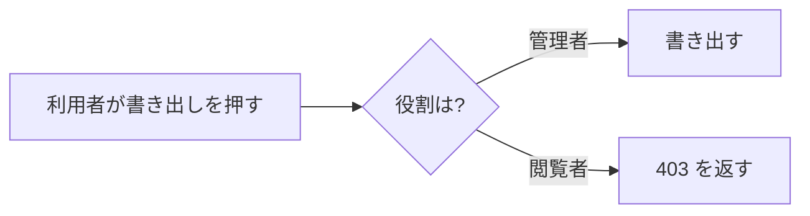
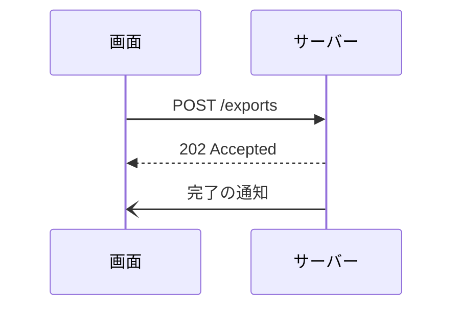

# 判定の仕組み

判定は `ExportPolicy` が受け持ちます。

```mermaid
flowchart LR
  A[利用者が書き出しを押す] --> B{役割は?}
  B -->|管理者| C[書き出す]
  B -->|閲覧者| D[403 を返す]
```

1 回の書き出しで、画面とサーバーは次のようにやり取りします。

```mermaid
sequenceDiagram
  participant 画面
  participant サーバー
  画面->>サーバー: POST /exports
  サーバー-->>画面: 202 Accepted
  サーバー-)画面: 完了の通知
```
